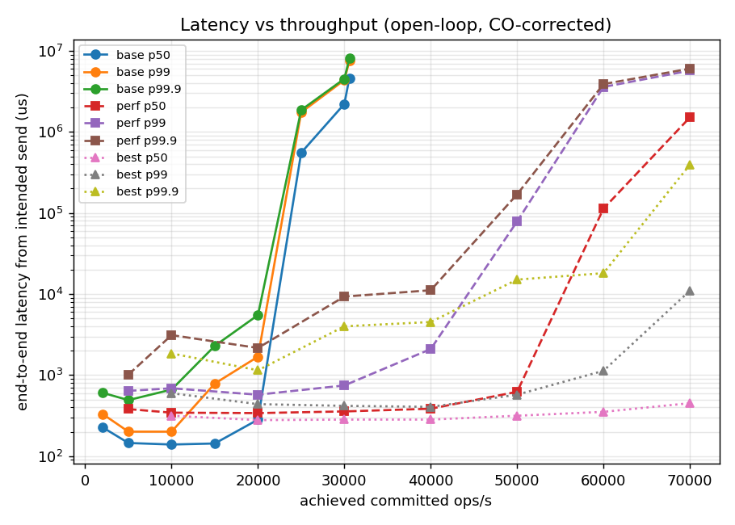
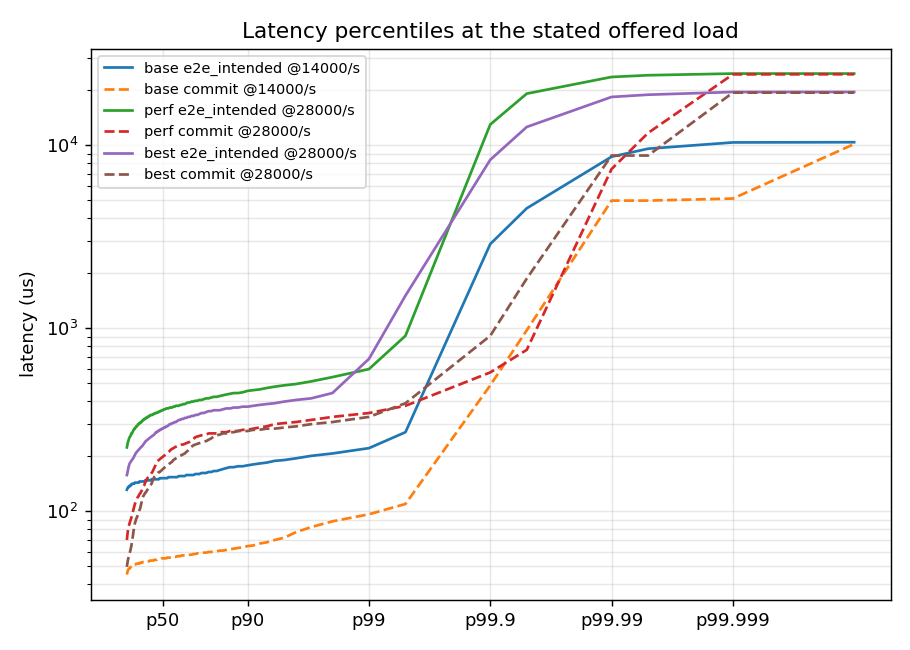
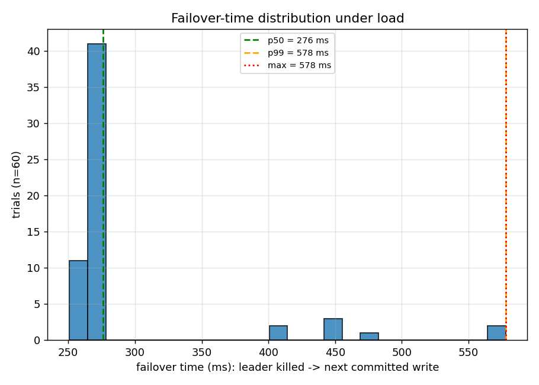
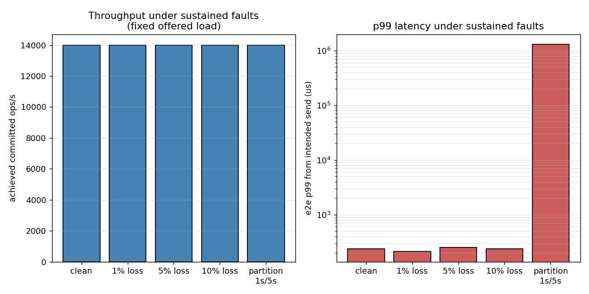

# raft-rsm — a low-latency replicated state machine on from-scratch Raft

A 3-node replicated key-value store over a Raft consensus core implemented
from scratch in C++20 — no consensus/RPC/queue libraries — with a
lock-free-pipeline performance layer and a rigorously measured benchmark
suite. Correctness is enforced by a deterministic simulator with seeded
chaos, five continuously-checked Raft safety invariants (each with a
must-flag self-test), and a per-key linearizability checker.

Full design record: [`DESIGN.md`](DESIGN.md). Specification:
`../raft_rsm_build_spec.md`. The order-book state machine and the full
architecture writeup land in Phase 9.

## Build and test

```bash
cmake -S . -B build -DCMAKE_BUILD_TYPE=Release
cmake --build build -j
ctest --test-dir build --output-on-failure

./build_and_test.sh   # Release + ASan/UBSan + TSan, all suites
```

## Run a 3-node cluster

```bash
cat > /tmp/peers.conf <<EOF
1 127.0.0.1 5001
2 127.0.0.1 5002
3 127.0.0.1 5003
EOF
for i in 1 2 3; do
  ./build/src/runtime/raft_node --id $i --config /tmp/peers.conf \
      --data-dir /tmp/rsm-node$i &
done
./build/src/runtime/kv_cli --config /tmp/peers.conf put hello world
./build/src/runtime/kv_cli --config /tmp/peers.conf get hello
```

`raft_node` knobs: `--fsync every|group`, `--wait block|spin`,
`--batch N --linger-us N` (group commit).

## Results

Everything below regenerates from **one script** — raw per-run JSON,
plots, and summary tables included:

```bash
sudo cpupower frequency-set -g performance   # host control (recorded)
bench/run_benchmarks.sh                      # ~45 min full suite
```

Raw data for the reported numbers: `bench/results/phase8/` (per-run JSON
with the full config, seed, and machine state captured at start and end of
every run; `machine.txt`; `plots/`; `summary.txt`).

### Methodology (the part that makes the numbers mean something)

- **Open-loop load for latency.** Fixed-rate arrivals; each request's
  latency is measured from its *intended* (scheduled) send time, so
  queueing behind a slowdown is charged to the requests that suffered it —
  the coordinated-omission correction. The harness proves the correction
  works: a self-test injects a 500 ms stall into the state machine and the
  corrected tail must report it (measured: intended-time p99 = 470 ms vs
  actual-send-time p99 = 1.9 ms — the uncorrected view hides the stall
  ~250×). Closed-loop generators are used for saturation throughput only,
  because closed loops self-throttle and understate tails.
- **The observer doesn't perturb the observed.** The load-generator hot
  loop and latency capture are allocation- and lock-free in steady state
  (asserted by a global-operator-new test, same discipline as the Phase 7
  pipeline); internal commit latency is measured on the Raft thread itself
  through existing seams.
- **Leadership stability is a health signal, not noise.** Every run records
  every term/role transition. A clean-load run with an election inside the
  measurement window is *invalid*: the harness refuses its numbers and
  exits nonzero. The sweep includes the stress regime (high concurrency +
  group commit + sustained duration) that historically exposed a
  threaded-runtime bug (DESIGN.md Phase 7), asserting the term stays
  constant.
- **Reproducibility.** Per-cell repeats with printed seeds (medians
  reported); same seed ⇒ same workload (unit-tested); plots regenerate
  from saved JSON without re-running.
- **Host control.** Each JSON embeds CPU model, governor, turbo state,
  load average, and hottest-thermal-zone temperature at run start and end.
  The three Raft threads are pinned to dedicated physical cores (measured:
  no throughput change, tighter p99.99); everything else floats — on a
  12-thread host running 12 pipeline threads there are no exclusive cores
  to hand out, and that is recorded rather than hidden.

**Test bed.** Intel i5-1235U (2 P-cores + 8 E-cores, 12 threads), 7.4 GiB
RAM, Fedora (Linux 6.19), governor `performance` on all CPUs for every run
(asserted from the per-run machine records), turbo on, otherwise idle, max
thermal-zone temperature 82 °C across the suite. 3-node cluster over
loopback TCP, one process (equivalent contention to the spec's
3-processes-on-one-host topology — same threads, same cores, same sockets;
see DESIGN.md). 16-byte values, 64-key PUT workload, election timeout
150–300 ms, heartbeat 50 ms. Raft threads pinned (one per physical core);
3 repeats per sweep cell, medians reported, seeds 1–3.

**Honest host caveat.** This is a U-series laptop, not a fixed-frequency
server: under the suite's continuous load the package settles to its
sustained power limit, and isolated burst runs measure up to ~35 % higher
than mid-suite cells (33 k vs 24 k ops/s at 16 clients, batch off). All
reported numbers are from the *sustained* state — mutually comparable and
conservative. The methodology carries no such caveat; rerun the same
script on a dedicated box for better absolute numbers.

### Throughput (committed ops/s)

Group commit is the dominant knob; blocking waits beat busy-spin on this
host at every measured operating point (with 16+ client threads sharing 12
hardware threads, spinning pipeline threads steal the cores the clients
need — the opposite of the lightly-loaded Phase 7 powersave measurements,
and exactly the workload-dependence the knob exists to expose).

| 16 clients, tmpfs | batch 1 | batch 4 | batch 8 | batch 16 | batch 32 |
|---|---|---|---|---|---|
| block | 24,009 | 57,399 | 68,770 | **82,970** | 43,490 |
| spin | 19,325 | 43,841 | 50,940 | 46,877 | 36,178 |

Batch 32 regresses because 32 > the 16 in-flight requests, so every batch
waits out the 200 µs linger — the documented batch ≤ concurrency rule.

Concurrency (batch off, block): 1 client → 14,576 (p50 68 µs), 2 → 18,394,
4 → 21,834, 8 → 24,437, 16 → 24,009, 32 → 23,460 — saturation at ~8
clients. The single-client point is the honest pipeline-hop cost (~68 µs
per committed write including fsync on tmpfs).

**fsync policy (real btrfs NVMe disk, 16 clients):** per-entry fsync
(batch 1) → 464 ops/s; group commit batch 8 → 3,531 ops/s (7.6×); batch 32
→ 3,226. The `--fsync every|group` flag at batch 1 measures 464 vs 470
ops/s — the documented by-construction equivalence; the *real* fsync knob
is the batch size (one fsync per batch).

### Latency at a stated offered load (open-loop, CO-corrected)

20-second windows, 48 generator threads, latencies in µs from the
*intended* send time (plus the leader-internal commit latency: request
enqueued at leader → entry committed, measured on the Raft thread).

**No batching (base), 14,000 req/s offered — 280k samples/run:**

| series | p50 | p99 | p99.9 | p99.99 | max |
|---|---|---|---|---|---|
| end-to-end (intended send) | 152 | 221 | 2,621 | 8,651 | 9,973 |
| end-to-end (actual send) | 95 | 166 | 1,704 | 8,651 | 9,918 |
| commit (leader internal) | 54 | 96 | 487 | 4,719 | 9,777 |

**Best config (batch 16 + block), 28,000 req/s offered — 560k samples/run:**

| series | p50 | p99 | p99.9 | p99.99 | max |
|---|---|---|---|---|---|
| end-to-end (intended send) | 283 | 967 | 8,323 | 18,088 | 19,130 |
| end-to-end (actual send) | 231 | 647 | 2,818 | 9,306 | 19,075 |
| commit (leader internal) | 170 | 340 | 1,573 | 8,782 | 19,005 |

(The Phase 7 throughput config, batch 8 + spin at the same 28 k/s, is
worse on every percentile — p50 356, p99 1,032, p99.9 16,122 — and is in
the raw data as `headline.perf`.) The intended-vs-actual gap at p99.9+ is
the coordinated-omission correction doing its job on production data:
transient backlogs that late dispatch would hide are charged to the
requests that waited through them. Stated loads are picked from the saved
sweep by `pick_rate.py` (70 % of the highest rate every repeat sustained
with p99 ≤ 50 ms and p99.9 ≤ 20 ms).

### Latency vs throughput



The knee, per configuration (10 s windows): **base** (no batching) holds
p99 ≤ 1.7 ms through 20 k/s and collapses at 25 k/s; **best**
(batch 16 + block) holds p99 ≤ 1.2 ms through 60 k/s in these windows,
with the p99.9 tail starting to grow past 40 k/s and a hard wall at
70 k/s (p99.9 = 394 ms, schedule still fully served). Longer 20 s runs
show the *sustained* comfortable envelope for the best config is
~40 k/s — burst windows flatter the knee, which is why the stated-load
tables above sit at 70 % of the rep-robust sustainable rate, not at the
cliff edge.



### Failover-time distribution



60 trials under 8-client load: the current leader is killed at a known
instant (its restart between trials replays from disk — the Phase 4 path);
a probe client with 100 ms attempts measures time to the *next committed
write*, leader discovery included. **p50 = 276 ms, p90 = 451 ms,
p99 = max = 578 ms.** The distribution is bimodal exactly as Raft predicts
with a 150–300 ms randomized election timeout: the main mass is one
election timeout plus a round trip; the 400–580 ms cluster is trials where
the first candidate lost the race (split vote / stale-log candidate) and a
second timeout fired. This is why failover is reported as a distribution,
never a single number — and why these *intentional* kills are distinct
from clean-load elections, which the harness treats as bugs.

### Behavior under sustained faults



Open-loop at a fixed 14 k req/s offered load (single runs):

| condition | achieved/s | p50 µs | p99 µs | elections |
|---|---|---|---|---|
| clean | 14,000 | 154 | 236 | 0 |
| 1 % message loss | 14,000 | 147 | 213 | 0 |
| 5 % loss | 14,000 | 154 | 252 | 0 |
| 10 % loss | 14,000 | 152 | 240 | 0 |
| partition 1 s every 5 s | 14,000 | 154 | 1,291,846 | 5 |

Sustained symmetric message loss up to 10 % is absorbed with no measurable
degradation at this load (loopback RTTs make retransmission cheap; commit
needs one of two followers per entry, heartbeats re-drive the rest) and no
leadership instability. Periodic partitions behave exactly as the protocol
says they must: while the leader is isolated (~1 s + election) nothing
commits, and the CO-corrected p99 honestly charges those outages to the
requests scheduled during them — the p50 shows full recovery between
partitions, and the offered rate is still served. Closed-loop variants
(`fault.closed.*` in the raw data) hold 23–29 k ops/s across all loss
rates — within the host's sustained-power variance band for single runs;
the signal is the absence of degradation, not the ±20 % spread.

**Stress regime** (the Phase 7 lesson, now a standing benchmark gate):
32 clients + group commit (batch 8, spin) + 30 s sustained =
**52,948 ops/s with zero elections and the term constant** — 1.59 M
committed entries, 356 MB of logs, no compaction needed (the snapshotting
deferral evidence, recorded as `data_bytes` in every run).

Leadership stability held across the entire suite: **zero invalid runs in
150+** — no clean-load run ever recorded an election inside its
measurement window.

### Plots

| plot | file |
|---|---|
| Latency vs throughput (knee) | `bench/results/phase8/plots/latency_vs_throughput.png` |
| Latency percentile curves | `bench/results/phase8/plots/latency_percentiles.png` |
| Throughput vs batch size | `bench/results/phase8/plots/throughput_vs_batch.png` |
| Throughput vs concurrency | `bench/results/phase8/plots/throughput_vs_clients.png` |
| Failover distribution | `bench/results/phase8/plots/failover_distribution.png` |
| Sustained faults | `bench/results/phase8/plots/faults.png` |

## Future work

- **Snapshotting / log compaction + `InstallSnapshot`** — deferred with
  evidence: log growth never constrained a benchmark run (`data_bytes`
  recorded per run); the state machine (including the exactly-once session
  table) has been snapshot-serializable since Phase 5.
- Dynamic membership (joint consensus), multi-host/WAN deployment, TLS and
  auth, Byzantine fault tolerance, a query layer — explicit non-goals per
  the spec.
- ReadIndex / lease reads (reads currently go through the log for
  by-construction linearizability).
