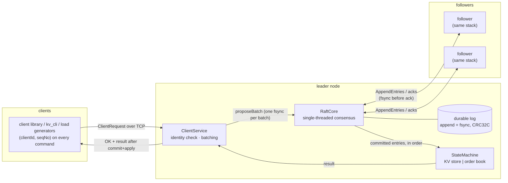
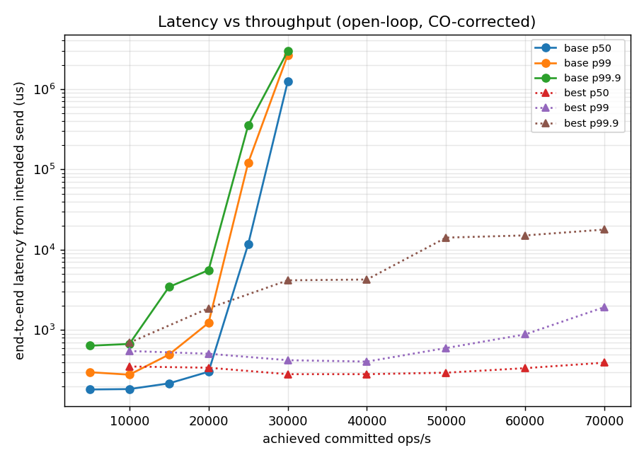

# raft-rsm — a replicated matching engine on from-scratch Raft

A 3-node **replicated state machine over a Raft consensus core implemented
from scratch in C++20** — no consensus, RPC, or lock-free-queue libraries —
carrying two state machines behind one interface: a key-value store
(baseline) and a **price-time-priority order-book matching engine**
(showcase), with a lock-free-pipeline performance layer and a rigorously
measured benchmark suite.

The idea that ties it together: **the Raft log is a deterministic
total-order sequencer.** A matching engine's price-*time* priority is
"first come, first served within a price level" — and here arrival order
*is* committed-log order, identical on every replica. So the matching
engine is a pure deterministic fold over the sequence the cluster already
agrees on: integer ticks, FIFO by apply order, order ids from a counter in
applied state, no wall clock anywhere. The KV store and the order book are
two folds over the same agreed sequence — swapping one for the other
touched zero consensus, runtime, or transport code.

Headline numbers (3-node commit on one host, methodology and caveats
below): **consensus-path commit latency 76 µs p50 / 199 µs p99** at a
stated 14 k/s load, **sub-millisecond end-to-end p50 through 60 k ops/s**
(open-loop, coordinated-omission-corrected), **69 k committed writes/s**
peak, **failover p50 277 ms / max 629 ms** over 60 leader kills — and the
same harness pointed at the replicated matching engine (numbers in the
[order-book section](#the-order-book-showcase-replicated-matching-engine)).
The bigger differentiator is *how* these were obtained: a deterministic
seeded-chaos simulator with five continuously-checked safety invariants
(each with a must-flag self-test), a per-key linearizability checker, a
golden-model matching-engine check, and a benchmark harness whose
coordinated-omission correction is itself proven by a self-test.

Full decision record: [`DESIGN.md`](DESIGN.md).

---

## Architecture



An entry is acknowledged to the client only after it is **committed** (on a
majority's disks, leader's term) and **applied**. Reads go through the log
too, so every operation is linearizable by the same argument as writes.

Per node, the Phase 7 performance layer runs four threads connected by
hand-written lock-free rings (cache-line-padded SPSC Lamport rings and a
Vyukov-style MPSC), with all outbound messages encoded on the producing
thread:

```
transport I/O thread ──(inbound MPSC)──▶ Raft thread
  (rx: read+decode                  (sole owner of RaftCore;
   into ring slots)                  batching, group commit)
                                       │                 │
                              (raftTx SPSC)      (apply SPSC, lossless)
                                       │                 │
                                       ▼                 ▼
                                  tx thread ◀─(applyTx SPSC)─ apply thread
                              (socket writes)        (sm.apply + replies)
```

Two properties are load-bearing: the committed→apply ring **refuses instead
of blocking** when full, so a slow state machine can delay client replies
but can never stall heartbeats or elections (the bug this prevents was
real — see the testing story); and the steady-state pipeline performs
**zero heap allocations** on every thread, enforced by a test that overrides
global `operator new` and charges every allocation to its thread.

Module layout (each a CMake target with a narrow interface; the Raft core
does not know TCP exists or which state machine is plugged in):

| dir | what |
|---|---|
| `src/transport` | loopback TCP, length-prefixed framing, raw-frame ingress |
| `src/rpc` | wire format: strict, allocation-bounded encode/decode |
| `src/raft` | the consensus core: election, replication, commit, apply |
| `src/storage` | append-only CRC32C log + atomic-rename metadata, fsync policies, torn-tail recovery |
| `src/statemachine` | the `StateMachine` interface; KV store; **order-book matching engine** |
| `src/client` | leader routing, redirects, retries with stable `(clientId, seqNo)` |
| `src/runtime` | rings, thread topology, `raft_node` / `kv_cli` executables |
| `src/metrics` | HDR-style latency histogram, allocation accounting |
| `faults/` | deterministic simulator: seeded network/node faults, invariant checkers, chaos driver |
| `test/`, `bench/` | the suites and the measured-results machinery |

## The testing story (read this before the numbers)

Distributed-systems code is only as good as the falsification effort behind
it, so this project's main investment is the correctness machinery:

- **Deterministic simulation.** `RaftCore` reaches the world through four
  seams (a `Clock`, a send callback, `handle()`, a seeded RNG). The
  simulator replaces TCP with a seeded in-memory bus (drop, delay, reorder,
  partition), time with a manual clock, and threads with a single
  virtual-time scheduler — while running the **byte-identical production
  code** for consensus, durable storage (real files, real replay after
  every crash), sessions, and both state machines. Same seed ⇒
  line-identical run trace, which is itself a tested property.
- **Seeded chaos with continuously-checked invariants.** Each chaos run
  drives concurrent clients through randomized partitions, message loss,
  reorders, crashes, restarts, and leader kills, while monitors check the
  five Raft safety invariants (Election Safety, Leader Append-Only, Log
  Matching, Leader Completeness, State Machine Safety) *throughout the
  run* — plus no-lost-commit (everything acknowledged survives) and
  post-heal convergence. **Every checker has a must-flag self-test**: a
  checker that cannot fail proves nothing. Any failing seed reproduces
  with one command: `./build/faults/chaos_sim --seed N`.
- **Linearizability.** Client histories from every KV chaos run go through
  an in-repo per-key Wing&Gong-style checker — sound by construction,
  self-validated against known-good and known-bad histories.
- **Exactly-once.** Sessions dedup at *apply time in replicated state*, so
  a retry across a leader failover returns the cached result instead of
  re-executing. For the matching engine this has real teeth — a re-applied
  NEW would fill twice — and a dedicated test replays exactly that
  scenario against resting liquidity.
- **The order-book correctness pair.** Cross-replica identity: at the end
  of every order-book chaos run, all replicas' serialized books (orders,
  id counter, session table) must be byte-identical, and a fresh engine
  folding the committed log must land on the same bytes. Golden-model
  equivalence: seeded command streams (and every chaos run's committed
  stream) are replayed through an **independently written reference
  matcher** and must agree on every result byte and the final book — a
  check that is itself validated by three deliberately broken reference
  variants it must flag.
- **The bug that justifies the paranoia.** The threaded runtime once
  *blocked* the Raft thread when the apply ring filled; under a
  group-commit burst into a slow state machine this stalled heartbeats past
  the election timeout and triggered a spurious election. The
  deterministic sim could never see it (no threads); it was caught in
  review, redesigned to refusal + re-offer, and pinned by a cluster test
  that demonstrably fails against the blocking version. Threaded bugs need
  threaded tests: the whole TCP suite runs under ThreadSanitizer, and
  ASan/UBSan/TSan green is a phase gate (`./build_and_test.sh`).

## Measurement methodology (the part that makes numbers mean something)

- **Open-loop load for latency.** Fixed-rate arrivals; each request's
  latency is measured from its *intended* (scheduled) send time, so
  queueing behind a slowdown is charged to the requests that suffered it —
  the coordinated-omission correction. The harness proves the correction
  works: a self-test injects a 500 ms stall into the state machine and the
  corrected tail must report it (measured: intended-time p99 = 470 ms vs
  actual-send-time p99 = 1.9 ms — the uncorrected view hides the stall
  ~250×). Closed-loop generators are used for saturation throughput only,
  because closed loops self-throttle and understate tails.
- **The observer doesn't perturb the observed.** The load-generator hot
  loop and latency capture are allocation- and lock-free in steady state
  (asserted by a global-operator-new test); internal commit latency is
  measured on the Raft thread itself through existing seams. Latency is
  captured with the **in-repo HDR-style log-linear histogram** (~1.6 %
  worst-case quantization, allocation-free, mergeable) — not vendored
  HdrHistogram_c; quantization sits an order of magnitude below run-to-run
  variance.
- **Leadership stability is a health signal, not noise.** Every run records
  every term/role transition. A clean-load run with an election inside the
  measurement window is *invalid*: the harness refuses its numbers and
  exits nonzero. The stress regime that historically exposed the
  apply-backpressure bug is a standing benchmark gate.
- **Reproducibility.** Per-cell repeats with printed seeds (medians
  reported); same seed ⇒ same workload (unit-tested); stated loads are
  picked from the saved sweep by a written-down, rep-robust criterion
  (`pick_rate.py`); plots regenerate from saved JSON without re-running.
- **Topology, honestly.** The benchmarked cluster is the full production
  wiring — TCP on loopback ports, durable logs, the threaded runtime — but
  the three nodes live **in one process** so the instruments attach through
  existing seams. Host-level contention is equivalent to the spec's
  3-processes-on-one-host topology (same threads, cores, loopback sockets);
  real network RTT is excluded and would add a roughly constant term.
  Cross-process wiring is validated separately and on record: real
  three-`raft_node`-process clusters serving `kv_cli`, for the KV store
  (`bench/results/phase8/three_process_smoke.txt`) and for the matching
  engine across a live `kill -9` failover
  (`bench/results/phase9/three_process_smoke.txt`).
- **Host control.** Each JSON embeds CPU model, governor, turbo state, load
  average, and hottest-thermal-zone temperature at run start and end. The
  three Raft threads are pinned to dedicated physical cores (measured
  value: scheduling-variance control, not a mean shift); on a 12-thread
  host running 12 pipeline threads there are no exclusive cores to hand
  out, and that is recorded rather than hidden.

**Test bed.** Intel i5-1235U (2 P-cores + 8 E-cores, 12 threads), 7.4 GiB
RAM, Fedora (Linux 6.19), tmpfs data dirs unless stated. KV numbers:
governor `performance` for every run, asserted from the per-run records.
**Honest host caveat:** this is a U-series laptop, not a fixed-frequency
server — under continuous load the package settles to its sustained power
limit, and isolated burst runs measure tens of percent higher than
mid-suite cells. All reported numbers are from the *sustained* state:
mutually comparable and conservative. The methodology carries no such
caveat; rerun the same scripts on a dedicated box for better absolute
numbers.

## Results — the consensus path (KV workload)

Everything in this section regenerates from **one script** (raw per-run
JSON, plots, and summary tables): `bench/run_benchmarks.sh` (~45 min; raw
data in `bench/results/phase8/`).

### Latency at a stated offered load (open-loop, CO-corrected)

20-second windows, 48 generator threads, latencies in µs from the
*intended* send time; commit = request enqueued at leader → entry
committed, measured on the Raft thread.

**No batching (base), 14,000 req/s offered — 280k samples/run:**

| series | p50 | p99 | p99.9 | p99.99 | max |
|---|---|---|---|---|---|
| end-to-end (intended send) | 211 | 426 | 4,981 | 10,486 | 11,785 |
| end-to-end (actual send) | 154 | 369 | 2,097 | 10,093 | 11,728 |
| commit (leader internal) | **76** | **199** | 508 | 5,243 | 11,338 |

**Best config (batch 16 + block), 35,000 req/s offered — 700k samples/run:**

| series | p50 | p99 | p99.9 | p99.99 | max |
|---|---|---|---|---|---|
| end-to-end (intended send) | 360 | 655 | 10,486 | 19,923 | 20,556 |
| end-to-end (actual send) | 307 | 590 | 893 | 10,879 | 20,499 |
| commit (leader internal) | 182 | 381 | 479 | 5,046 | 20,360 |

The intended-vs-actual gap at p99.9 — 10,486 µs vs 893 µs in the best-config
table — is the coordinated-omission correction doing its job on production
data: transient backlogs that late dispatch would hide are charged to the
requests that waited through them. Stated loads are 70 % of the highest
rate every repeat sustained with ≥ 99 % rate fidelity, p99 ≤ 50 ms and
p99.9 ≤ 20 ms.

### Latency vs throughput (the knee)


10 s windows: **base** (no batching) holds p99 ≤ 1.4 ms through 20 k/s and
collapses at 25 k/s; **best** (batch 16 + block) holds **sub-millisecond
p50 with p99 ≤ 2.8 ms through 60 k/s** and hits a hard wall at 70 k/s. The
p99.9 tail starts growing past 40 k/s — which is exactly why the stated-load
criterion is rep-robust and the headline tables sit at 70 % of sustainable,
not at the cliff edge.


### Throughput (committed ops/s, closed-loop saturation)

Group commit is the dominant knob — one fsync and one AppendEntries per
batch:

| 16 clients, tmpfs | batch 1 | batch 4 | batch 8 | batch 16 | batch 32 |
|---|---|---|---|---|---|
| block | 26,498 | 52,299 | 55,486 | **69,122** | 38,900 |
| spin | 18,133 | 52,710 | 58,700 | 52,560 | 41,188 |

Batch 32 regresses because 32 > the 16 in-flight requests, so every batch
waits out the 200 µs linger — the documented batch ≤ concurrency rule. The
wait-mode knob lands on the Phase 7 trade-off: busy-spin wins at low
concurrency where wake latency dominates (1 client: spin 13,891 ops/s at
p50 72 µs vs block 10,001 at 98 µs); blocking wins once many client threads
compete with the 12 pipeline threads for 12 hardware threads.

**fsync-bound (real btrfs NVMe disk, 16 clients):** per-entry fsync
(batch 1) → 446 ops/s; group commit batch 8 → 3,216 ops/s (**7.2×**). The
`--fsync every|group` flag at batch 1 measures 446 vs 444 ops/s — the
documented by-construction equivalence; the *real* fsync knob is the batch
size (one fsync per batch).

### Failover-time distribution


60 trials under 8-client load: the leader is killed at a known instant; a
probe client measures time to the *next committed write*, leader discovery
included. **p50 = p90 = 277 ms, p99 = max = 629 ms.** The distribution is
bimodal exactly as Raft predicts with a 150–300 ms randomized election
timeout: the main mass is one timeout plus a round trip; the 400–630 ms
cluster is trials where the first candidate lost the race and a second
timeout fired. Failover is reported as a distribution, never a single
number — and these *intentional* kills are distinct from clean-load
elections, which the harness treats as bugs.

### Behavior under sustained faults


Faults are measured **open-loop at a fixed offered load** — the load does
not politely back off because the cluster is degraded. 14 k req/s offered,
medians of 3:

| condition | achieved/s | p50 µs | p99 µs | elections |
|---|---|---|---|---|
| clean | 14,000 | 209 | 418 | 0 |
| 1 % message loss | 14,000 | 209 | 414 | 0 |
| 5 % loss | 14,000 | 211 | 393 | 0 |
| 10 % loss | 14,000 | 211 | 381 | 0 |
| partition 1 s every 5 s | 14,000 | 217 | 1,308,623 | 5 |

Sustained symmetric loss up to 10 % is absorbed with the offered rate fully
served, the tail essentially unmoved, and zero elections. Periodic
partitions read exactly as the protocol dictates: the five elections are
the expected majority-side re-elections (one per leader isolation), and the
CO-corrected p99 of ~1.3 s **honestly reflects the outage window** — each
partition stops commits for ~1 s plus an election, and those waits are
charged to the requests scheduled during them, while the p50 of 217 µs
shows full recovery between partitions.

Closed-loop fault runs exist in the raw data but **closed-loop
throughput-under-loss is not presented as a finding**: on an oversubscribed
host, dropping inter-node messages frees contended CPU that self-throttled
clients immediately convert into more requests, so measured throughput can
*rise* with loss (it does: 26.1 k clean → 30.5 k at 10 %). That measurement
artifact is precisely why the fault story is open-loop.

**Stress regime** (standing gate): 32 clients + group commit + 30 s
sustained = **75,140 ops/s with zero elections and the term constant** —
2.25 M committed entries, 500 MB of logs, no compaction needed (the
snapshotting-deferral evidence, recorded as `data_bytes` in every run).
Across the entire 194-run KV suite: **zero invalid runs** — no clean-load
run ever recorded an election inside its measurement window.

## The order-book showcase: replicated matching engine

`NEW` (limit order), `CANCEL`, `AMEND` with price-time priority behind the
same `StateMachine` interface as the KV store (`--sm kv|orderbook`
selects, everywhere). Determinism is the headline correctness property:
integer prices/quantities (ticks/lots — never floating point), FIFO within
a price level **by apply order** (= committed-log order), order ids from a
counter in applied state, fills at the maker's price, ordered containers
only. AMEND keeps time priority on a same-price quantity decrease and is
cancel-replace (same id, can cross) otherwise. Verified by matching units,
golden-model equivalence against an independent reference matcher
(self-validated), byte-identical books across replicas at the end of every
chaos run, exactly-once order entry across leader failover, and the full
chaos suite with the order-book SM swapped in — see the testing story.

### Order-book numbers

Produced by `bench/run_orderbook_bench.sh` — the Phase 8 harness pointed at
the matching engine with a NEW-order workload (side uniform, price uniform
in a ±10-tick band around 100 so matching is continuous, qty 1–10), same
open-loop CO-corrected methodology, same leadership-validity gates, same
stated-load criterion. Raw data: `bench/results/phase9/`.

**Host state for this set (the per-run records caught a real event):**
every JSON embeds the machine state at run start *and* end, and they show
the CPU governor flipping `performance` → `powersave` mid-suite (during
`open.best.rate30000.r1` — most likely a power-profile/AC event). So: the
closed-loop cells, the single-client cell, and the entire no-batching
sweep ran under `performance` (directly comparable to the KV suite); the
upper best-config sweep, both headline cells, and the failover ran under
`powersave` (conservative; not strictly comparable). One uninterrupted
re-run of the script under `performance` collapses this caveat; the
numbers below are honest for the recorded state. Medians of 3 repeats,
seeds printed, rev stamped in `machine.txt`.

| measurement | result |
|---|---|
| closed-loop saturation (16 clients, batch 16) | **55,137 orders/s matched+committed** |
| single client, no batching, busy-spin | 13,302 orders/s; e2e p50 **73 µs** |
| stated load, no batching (14 k orders/s offered) | e2e p50 147 µs, p99 295 µs; **commit p50 53 µs / p99 114 µs** |
| stated load, batch 16 (49 k orders/s offered) | e2e p50 307 µs, p99 565 µs; commit p50 154 µs / p99 315 µs |
| open-loop knee (batch 16) | p99 ≤ 600 µs through 50 k/s; offered rate still fully served at 70 k/s with p99 1.9 ms |
| failover under order load (30 leader kills) | next committed order: p50 278 ms, p99 = max = 633 ms |
| validity | zero invalid runs; zero clean-load elections |

At the 49 k/s stated load the CO gap shows up on matching-engine data just
as it did on KV: p99.9 from intended send = 28.6 ms vs 0.86 ms from actual
send — transient backlogs charged to the orders that waited through them.



**Why these aren't identical to the KV numbers — and why the differences
point the right way.** The deltas go in *opposite directions* (commit p50
53 µs vs KV's 76 µs and a 49 k vs 35 k stated load, but 55 k vs 69 k
closed-loop saturation), so this is not "the matcher is faster than a map
insert". The comparisons that share host state settle it: single-client
p50 is 73 µs vs the KV suite's 72 µs (both `performance`) — the per-op
pipeline cost is identical, and both state machines' apply work is noise
against the consensus path. The systematic differences are wire-shaped: a
NEW order command is smaller than the KV PUT (34 vs ~43 bytes — lighter
append/replication per entry, which favors the unbatched open-loop cells),
while order-book replies carry a fills payload instead of KV's one status
byte (more per-reply client work, which costs at closed-loop saturation
where 16 client threads fight 12 pipeline threads for 12 hardware
threads). The headline-cell deltas (commit p50, stated load) additionally
carry the governor confound above — they were recorded under `powersave` —
and the higher stated load is partly the rep-robust criterion itself: the
KV run had one 60 k/s repeat blow the p99.9 bound (a 258 ms backlog
episode), capping its sustainable rate at 50 k, while every order-book
repeat held the bounds through 70 k. The architectural claim survives all
of it: ordering comes from the replicated log, the deterministic matching
fold rides on it at consensus speed, and State Machine Safety carries the
same guarantee for fills that it carries for key-value writes.

## Build, run, test

This directory (`raft-rsm`, the one containing `CMakeLists.txt` and this
README) is the repository root — clone it directly. (If you received it
embedded in an outer workspace repo, note the outer repo tracks it as a
bare gitlink: clone/copy this inner repository itself, or a fresh checkout
of the outer repo yields an empty directory here.)

Requirements: Linux, CMake ≥ 3.20, GCC with C++20 (tests also build with
ASan/UBSan/TSan; `libtsan` must be installed for the TSan gate). No
third-party libraries are fetched: the only vendored dependency is the
doctest single header.

```bash
git clone <this-repo> raft-rsm && cd raft-rsm

# Release build + tests
cmake -S . -B build -DCMAKE_BUILD_TYPE=Release
cmake --build build -j
ctest --test-dir build --output-on-failure

# Full phase gate: Release + ASan/UBSan + TSan, all suites
./build_and_test.sh
```

Run a 3-node cluster (separate processes, loopback TCP):

```bash
cat > /tmp/peers.conf <<EOF
1 127.0.0.1 5001
2 127.0.0.1 5002
3 127.0.0.1 5003
EOF
for i in 1 2 3; do
  ./build/src/runtime/raft_node --id $i --config /tmp/peers.conf \
      --data-dir /tmp/rsm-node$i &
done
./build/src/runtime/kv_cli --config /tmp/peers.conf put hello world
./build/src/runtime/kv_cli --config /tmp/peers.conf get hello
```

Same cluster as a matching engine (`--sm orderbook` on the nodes):

```bash
for i in 1 2 3; do
  ./build/src/runtime/raft_node --id $i --config /tmp/peers.conf \
      --data-dir /tmp/ob-node$i --sm orderbook &
done
./build/src/runtime/kv_cli --config /tmp/peers.conf ob-new sell 100 10
./build/src/runtime/kv_cli --config /tmp/peers.conf ob-new buy 100 4
./build/src/runtime/kv_cli --config /tmp/peers.conf ob-cancel 1
```

`raft_node` knobs: `--sm kv|orderbook`, `--fsync every|group`,
`--wait block|spin`, `--batch N --linger-us N` (group commit).

Reproduce the numbers (run on an idle, AC-powered box; the scripts set or
warn about the CPU governor and record host state either way):

```bash
sudo cpupower frequency-set -g performance   # host control (recorded)
bench/run_benchmarks.sh                      # KV suite (~45 min) -> bench/results/<stamp>/
bench/run_orderbook_bench.sh                 # order-book suite (~20 min) -> bench/results/phase9/
```

Replay any chaos seed:

```bash
./build/faults/chaos_sim --seed 7                 # KV workload
./build/faults/chaos_sim --seed 7 --sm orderbook  # matching engine
```

## Limitations and future work

Deliberate non-goals (a measured, correct, 3-node, no-snapshot system over
an unmeasured feature-complete one):

- **Snapshotting / log compaction + `InstallSnapshot`** — deferred *with
  evidence*: log growth never constrained a benchmark run (max observed
  500 MB across 30 s of full-rate stress; `data_bytes` recorded per run),
  and both state machines (including the exactly-once session tables) have
  been snapshot-serializable since Phase 5.
- **Static 3-node membership** — no joint-consensus reconfiguration.
- **Single host / single DC** — loopback TCP by design; no WAN story.
- **No Byzantine tolerance, no TLS/auth, no query language.**
- **Reads through the log** — linearizable by construction; ReadIndex /
  lease reads are the obvious next latency win for read-heavy workloads.
- **Matching engine scope** — limit orders only (no market/IOC/stop), no
  self-trade prevention, no market-data feed; the per-key linearizability
  checker was not extended to order-book semantics (the golden-model +
  cross-replica-identity checks stand in).
